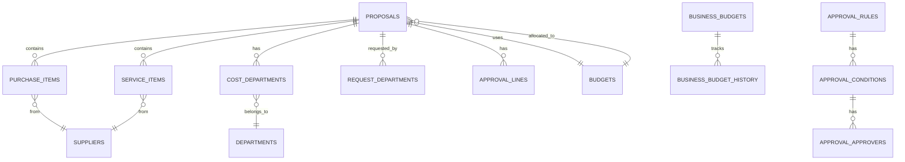

# 📊 데이터베이스 ER 다이어그램

계약관리시스템(CMS)의 Entity-Relationship 다이어그램입니다.

## 📌 주요 엔티티 관계도

### 전체 구조 개요



---

## 🔑 핵심 테이블 관계

### 1. 품의서 (Proposals) 중심 관계

```
┌─────────────────────────────────────────────────────────────┐
│                        PROPOSALS                             │
│  (품의서 - 시스템의 중심 테이블)                               │
└────────────┬────────────────────────────────────────────────┘
             │
             ├──── 1:N ────→ PURCHASE_ITEMS (구매품목)
             │                    │
             │                    └──── N:1 ────→ SUPPLIERS (공급업체)
             │
             ├──── 1:N ────→ SERVICE_ITEMS (용역항목)
             │                    │
             │                    └──── N:1 ────→ SUPPLIERS (공급업체)
             │
             ├──── 1:N ────→ COST_DEPARTMENTS (비용귀속부서)
             │                    │
             │                    └──── N:1 ────→ DEPARTMENTS (부서)
             │
             ├──── 1:N ────→ REQUEST_DEPARTMENTS (요청부서)
             │
             ├──── 1:N ────→ APPROVAL_LINES (결재라인)
             │
             ├──── N:1 ────→ BUDGETS (예산)
             │
             └──── 1:N ────→ PROPOSAL_HISTORIES (변경이력)
```

**설명**:
- 한 품의서는 여러 개의 구매품목 또는 용역항목을 가질 수 있음
- 한 품의서는 여러 부서에 비용을 배분할 수 있음
- 한 품의서는 하나의 예산에 연결됨
- 모든 변경사항은 이력으로 추적됨

---

### 2. 예산 관리 구조

```
┌──────────────────────────────────────────────┐
│             BUDGETS (예산)                    │
│  - 일반예산 (general)                         │
│  - 사업예산 (business)                        │
└────────────┬─────────────────────────────────┘
             │
             │ 1:N
             ↓
┌──────────────────────────────────────────────┐
│          PROPOSALS (품의서)                   │
│  - 예산과 연결된 모든 품의서                    │
└──────────────────────────────────────────────┘


┌──────────────────────────────────────────────┐
│      BUSINESS_BUDGETS (사업예산)              │
│  - 사업별 상세 예산 관리                        │
└────────────┬─────────────────────────────────┘
             │
             │ 1:N
             ↓
┌──────────────────────────────────────────────┐
│  BUSINESS_BUDGET_HISTORY (변경이력)           │
│  - 모든 변경사항 추적 (KST)                    │
└──────────────────────────────────────────────┘
```

**핵심 로직**:
- **확정집행액** = SUM(결재완료 품의서.total_amount)
- **미집행액** = (예산 + 추가예산) - 기집행액
- **예산초과액** = MAX(0, 기집행액 - (예산 + 추가예산))

---

### 3. 결재 프로세스 구조

```
┌──────────────────────────────────────────────┐
│       APPROVAL_RULES (결재규칙)               │
│  - 금액별, 유형별 결재 규칙 정의                │
└────────────┬─────────────────────────────────┘
             │ 1:N
             ↓
┌──────────────────────────────────────────────┐
│     APPROVAL_CONDITIONS (결재조건)            │
│  - 규칙의 구체적인 조건                        │
└────────────┬─────────────────────────────────┘
             │ 1:N
             ↓
┌──────────────────────────────────────────────┐
│     APPROVAL_APPROVERS (결재자)               │
│  - 조건별 결재자 정보                          │
└──────────────────────────────────────────────┘


별도로:
┌──────────────────────────────────────────────┐
│          PROPOSALS (품의서)                   │
└────────────┬─────────────────────────────────┘
             │ 1:N
             ↓
┌──────────────────────────────────────────────┐
│      APPROVAL_LINES (결재라인)                │
│  - 실제 품의서별 결재 진행 상황                 │
│  - 순서별 결재자 및 상태                       │
└──────────────────────────────────────────────┘
```

**프로세스**:
1. 품의서 생성 시 금액과 유형에 따라 결재규칙 적용
2. 조건에 맞는 결재자를 자동으로 결재라인에 추가
3. 순서대로 결재 진행

---

### 4. 부서 및 조직 구조

```
┌──────────────────────────────────────────────┐
│        DEPARTMENTS (부서)                     │
│  - parent_id로 계층 구조 지원                  │
└────────────┬─────────────────────────────────┘
             │
             │ 자기참조 (parent_id)
             └─────→ DEPARTMENTS (상위 부서)
             
             │ 1:N
             ↓
┌──────────────────────────────────────────────┐
│     COST_DEPARTMENTS (비용귀속부서)            │
│  - 품의서별 비용 배분 내역                      │
└──────────────────────────────────────────────┘
```

---

### 5. 공급업체 관계

```
┌──────────────────────────────────────────────┐
│          SUPPLIERS (공급업체)                 │
│  - 사업자번호, 연락처 등 정보                   │
└────────────┬─────────────────────────────────┘
             │
             ├──── 1:N ────→ PURCHASE_ITEMS (구매품목)
             │
             └──── 1:N ────→ SERVICE_ITEMS (용역항목)
```

---

## 📊 데이터 흐름도

### 품의서 생성 → 결재 → 예산 집행

```
[1] 사용자가 품의서 작성
     │
     ├─ 기본 정보 입력 (PROPOSALS)
     ├─ 구매품목 추가 (PURCHASE_ITEMS)
     ├─ 용역항목 추가 (SERVICE_ITEMS)
     ├─ 비용귀속부서 설정 (COST_DEPARTMENTS)
     ├─ 요청부서 설정 (REQUEST_DEPARTMENTS)
     └─ 예산 연결 (budget_id)
     
     ↓

[2] 결재라인 자동 생성
     │
     ├─ 금액과 유형으로 APPROVAL_RULES 조회
     ├─ 조건에 맞는 APPROVAL_CONDITIONS 확인
     ├─ APPROVAL_APPROVERS에서 결재자 조회
     └─ APPROVAL_LINES 생성
     
     ↓

[3] 결재 진행
     │
     ├─ 각 결재자가 순서대로 승인/반려
     ├─ APPROVAL_LINES.status 업데이트
     └─ 모든 결재 완료 시 PROPOSALS.status = 'approved'
     
     ↓

[4] 예산 집행
     │
     ├─ PROPOSALS.budget_id로 연결된 BUDGETS 조회
     ├─ BUSINESS_BUDGETS.confirmed_execution_amount 자동 계산
     │   (SUM of approved proposals)
     └─ 미집행액, 예산초과액 실시간 계산
```

---

## 🔐 데이터 무결성 규칙

### Foreign Key Constraints

| 테이블 | 외래키 | 참조 테이블 | 동작 |
|--------|--------|------------|------|
| `purchase_items` | `proposal_id` | `proposals.id` | CASCADE (삭제 시 품목도 삭제) |
| `service_items` | `proposal_id` | `proposals.id` | CASCADE |
| `cost_departments` | `proposal_id` | `proposals.id` | CASCADE |
| `approval_lines` | `proposal_id` | `proposals.id` | CASCADE |
| `proposals` | `budget_id` | `budgets.id` | RESTRICT (예산 먼저 삭제 불가) |
| `purchase_items` | `supplier_id` | `suppliers.id` | SET NULL |
| `service_items` | `supplier_id` | `suppliers.id` | SET NULL |

### Unique Constraints

| 테이블 | 컬럼 | 설명 |
|--------|------|------|
| `departments` | `name` | 부서명 중복 불가 |
| `departments` | `code` | 부서코드 중복 불가 |
| `suppliers` | `name` | 업체명 중복 불가 |
| `contract_methods` | `name` | 계약방식명 중복 불가 |

### Check Constraints

- `budgets.remaining_amount >= 0` (잔여금액은 음수 불가)
- `proposals.total_amount >= 0` (총액은 음수 불가)
- `purchase_items.quantity > 0` (수량은 양수)
- `service_items.personnel_count >= 0` (인원은 0 이상)

---

## 📈 성능 최적화를 위한 인덱스

### 복합 인덱스

```sql
-- 품의서 검색 최적화
CREATE INDEX idx_proposals_status_type ON proposals(status, contract_type);
CREATE INDEX idx_proposals_budget_status ON proposals(budget_id, status);

-- 결재라인 조회 최적화
CREATE INDEX idx_approval_lines_proposal_order ON approval_lines(proposal_id, "order");

-- 예산 연도별 조회 최적화
CREATE INDEX idx_budgets_year_type ON budgets(year, type);
CREATE INDEX idx_business_budgets_year ON business_budgets(budget_year);

-- 품목 조회 최적화
CREATE INDEX idx_purchase_items_proposal ON purchase_items(proposal_id);
CREATE INDEX idx_service_items_proposal ON service_items(proposal_id);
```

---

## 💡 설계 철학

### 1. **정규화**
- 제3정규형(3NF) 준수
- 중복 데이터 최소화
- 데이터 무결성 보장

### 2. **유연성**
- TEXT 타입 활용 (purpose, basis 등)
- JSONB 타입으로 확장 가능한 데이터 저장 (history 테이블)
- ENUM 타입으로 타입 안정성 확보

### 3. **추적성**
- 모든 변경사항 이력 저장
- 생성일시, 수정일시 자동 기록
- KST 시간대 적용

### 4. **성능**
- 적절한 인덱스 설계
- 계산된 값은 실시간 JOIN 또는 뷰 활용
- 필요시 비정규화 (성능 vs 정규성 트레이드오프)

---

## 🔄 향후 확장 가능성

### 계획 중인 기능

1. **계약 실행 단계**
   - `contracts` 테이블 활용
   - 품의서 → 계약서 변환
   - 계약 이행 관리

2. **문서 관리**
   - `document_templates` 활용
   - 자동 문서 생성
   - 전자 서명 연동

3. **작업 관리**
   - `tasks` 테이블 활용
   - 워크플로우 자동화
   - 알림 시스템

---

## 📚 참고 자료

- [데이터베이스 스키마 개요](./DATABASE_SCHEMA.md)
- [데이터베이스 스키마 상세](./DATABASE_SCHEMA_DETAIL.md)
- [프로젝트 구조](./PROJECT_STRUCTURE.md)

---

**최종 업데이트**: 2025-10-20  
**작성자**: AI Assistant  
**버전**: 1.0

