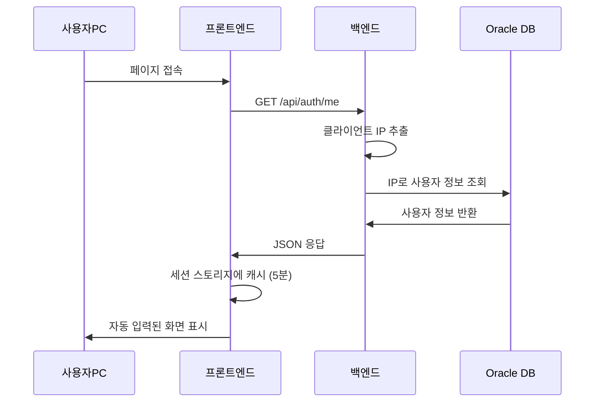

# IP 접근 제어 및 사용자 자동 인식 가이드

## 📋 목차
1. [개요](#개요)
2. [IP 접근 제어 설정](#ip-접근-제어-설정)
3. [사용자 자동 인식 시스템](#사용자-자동-인식-시스템)
4. [환경별 설정](#환경별-설정)
5. [외부 DB 연동 (Oracle)](#외부-db-연동-oracle)
6. [테스트 방법](#테스트-방법)
7. [문제 해결](#문제-해결)

---

## 📌 개요

계약관리시스템(CMS)은 두 가지 보안 기능을 제공합니다:

### 1️⃣ **IP 기반 접근 제어**
- 허가된 IP 주소 또는 IP 대역에서만 시스템 접근 가능
- 운영 환경에서 내부 네트워크만 허용
- 개발 환경에서는 선택적 활성화

### 2️⃣ **IP 기반 사용자 자동 인식**
- 클라이언트 단말 PC의 IP 주소로 사용자 자동 식별
- 품의서 작성자, 예산 담당자 등 자동 입력
- 외부 DB(Oracle)와 연동하여 실시간 사용자 정보 조회

---

## 🔒 IP 접근 제어 설정

### 환경변수 설정

#### `env.development` (개발 환경)
```env
# IP 접근 제어 비활성화 (개발 편의성)
IP_ACCESS_CONTROL_ENABLED=false

# 허용 IP 대역 (활성화 시 사용)
ALLOWED_IPS=172.22.*.*,127.0.0.1,localhost
```

#### `env.production` (운영 환경)
```env
# IP 접근 제어 활성화 (보안 강화)
IP_ACCESS_CONTROL_ENABLED=true

# 허용 IP 대역 (내부 네트워크만)
ALLOWED_IPS=172.17.*.*,172.22.*.*
```

### IP 패턴 지원 형식

| 패턴 | 설명 | 예시 |
|------|------|------|
| 정확한 IP | 단일 IP 주소 | `172.17.162.163` |
| 와일드카드 | IP 대역 (*.* 형식) | `172.17.*.*` |
| localhost | 로컬 접속 | `127.0.0.1`, `localhost` |
| 여러 개 | 쉼표로 구분 | `172.17.*.*,172.22.*.*,127.0.0.1` |

### 동작 방식

```javascript
// server.js - IP 접근 제어 미들웨어

1. 클라이언트 IP 추출
   - req.headers['x-forwarded-for'] (프록시 경유 시)
   - req.socket.remoteAddress (직접 접속 시)
   - req.ip (Express 기본)

2. 허용 IP 목록과 비교
   - 정확한 매칭: 172.17.162.163
   - 와일드카드 매칭: 172.17.*.* → 정규표현식 변환

3. 접근 허용/거부
   ✅ 허용: next() 호출, req.clientIP 저장
   ❌ 거부: 403 Forbidden 응답
```

### 접근 거부 시 응답

```json
{
  "error": "접근 권한이 없습니다.",
  "message": "허가되지 않은 IP 주소에서의 접근입니다.",
  "clientIP": "192.168.1.100"
}
```

---

## 👤 사용자 자동 인식 시스템

### 작동 원리



### API 엔드포인트

#### `GET /api/auth/me`

**요청**
```http
GET /api/auth/me HTTP/1.1
Host: localhost:3002
```

**응답**
```json
{
  "id": "U001",
  "name": "홍길동",
  "department": "IT팀",
  "position": "과장",
  "email": "hong@company.com",
  "clientIP": "172.17.162.50"
}
```

### 프론트엔드 사용 방법

#### 1. 컴포넌트 마운트 시 자동 로드

```javascript
import { getCurrentUser } from '../utils/userHelper';

const [currentUser, setCurrentUser] = useState({
  id: 'admin',
  name: '작성자',
  department: 'IT팀',
  position: '과장',
  email: 'admin@company.com'
});

useEffect(() => {
  const loadUserInfo = async () => {
    try {
      const user = await getCurrentUser();
      setCurrentUser(user);
      console.log('✅ 사용자 정보 로드 완료:', user);
    } catch (error) {
      console.error('❌ 사용자 정보 로드 실패:', error);
    }
  };
  
  loadUserInfo();
}, []);
```

#### 2. 사용자 정보 활용

```javascript
// 품의서 작성 시
const proposalData = {
  title: formData.title,
  createdBy: currentUser.name,  // 자동 입력
  department: currentUser.department,  // 자동 입력
  // ... 기타 필드
};
```

### 캐싱 전략

- **저장 위치**: `sessionStorage` (탭 닫으면 자동 삭제)
- **유효 시간**: 5분
- **캐시 키**: `currentUser`
- **자동 갱신**: 캐시 만료 시 자동으로 재조회

```javascript
// 캐시 삭제 (새로고침)
import { clearUserCache } from '../utils/userHelper';
clearUserCache();

// 강제 새로고침
import { refreshCurrentUser } from '../utils/userHelper';
const updatedUser = await refreshCurrentUser();
```

---

## ⚙️ 환경별 설정

### 개발 환경 (env.development)

```env
# 1. 내부 DB 연결
DB_HOST=172.22.32.200
DB_PORT=5432
PORT=3002

# 2. IP 접근 제어 (비활성화)
IP_ACCESS_CONTROL_ENABLED=false
ALLOWED_IPS=172.22.*.*,127.0.0.1,localhost

# 3. 외부 DB 연동 (비활성화)
EXTERNAL_DB_ENABLED=false

# 테스트 시에만 활성화:
# EXTERNAL_DB_ENABLED=true
# EXTERNAL_DB_HOST=oracle_test_server
# EXTERNAL_DB_PORT=1521
# EXTERNAL_USER_TABLE=TBUSER001M00
# ...
```

### 운영 환경 (env.production)

```env
# 1. 내부 DB 연결
DB_HOST=172.17.162.163
DB_PORT=5432
PORT=9331

# 2. IP 접근 제어 (활성화)
IP_ACCESS_CONTROL_ENABLED=true
ALLOWED_IPS=172.17.*.*,172.22.*.*

# 3. 외부 DB 연동 (활성화)
EXTERNAL_DB_ENABLED=true
EXTERNAL_DB_HOST=your_oracle_host
EXTERNAL_DB_PORT=1521
EXTERNAL_DB_NAME=your_oracle_sid
EXTERNAL_DB_USERNAME=your_oracle_user
EXTERNAL_DB_PASSWORD=your_oracle_password
EXTERNAL_DB_DIALECT=oracle

# 사용자 테이블 설정
EXTERNAL_USER_TABLE=TBUSER001M00
EXTERNAL_USER_ID_COLUMN=USER_ID
EXTERNAL_USER_NAME_COLUMN=USER_NAME
EXTERNAL_USER_DEPT_COLUMN=DEPT_CODE
EXTERNAL_USER_POSITION_COLUMN=POSITION_CODE
EXTERNAL_USER_EMAIL_COLUMN=EMAIL
EXTERNAL_USER_IP_COLUMN=IP_ADDRESS
```

---

## 🔗 외부 DB 연동 (Oracle)

### 필요한 테이블 정보

#### 1️⃣ 부서 정보 (이미 연동 완료 ✅)
```env
EXTERNAL_DEPT_TABLE=TBCPPD001M00
EXTERNAL_DEPT_CODE_COLUMN=DPCD
EXTERNAL_DEPT_NAME_COLUMN=DPNM
```

#### 2️⃣ 사용자 정보 (연동 예정)
```sql
-- 예시 테이블 구조
SELECT 
  USER_ID,        -- 사용자ID (사번)
  USER_NAME,      -- 사용자명
  DEPT_CODE,      -- 부서코드
  POSITION_CODE,  -- 직급코드
  EMAIL,          -- 이메일
  IP_ADDRESS      -- 단말 IP 주소
FROM TBUSER001M00
WHERE IP_ADDRESS = '172.17.162.50';
```

### IP-사용자 매핑 방식

#### 옵션 A: 테이블에 IP 컬럼 존재
```javascript
// config/externalDatabase.js
async function getUserByIP(clientIP) {
  const query = `
    SELECT 
      ${process.env.EXTERNAL_USER_ID_COLUMN} AS userId,
      ${process.env.EXTERNAL_USER_NAME_COLUMN} AS userName,
      ${process.env.EXTERNAL_USER_DEPT_COLUMN} AS deptCode,
      ${process.env.EXTERNAL_USER_POSITION_COLUMN} AS position,
      ${process.env.EXTERNAL_USER_EMAIL_COLUMN} AS email
    FROM ${process.env.EXTERNAL_USER_TABLE}
    WHERE ${process.env.EXTERNAL_USER_IP_COLUMN} = :clientIP
  `;
  
  const result = await externalSequelize.query(query, {
    replacements: { clientIP },
    type: QueryTypes.SELECT
  });
  
  return result[0];
}
```

#### 옵션 B: IP 대역대로 부서 자동 매핑
```javascript
function getDepartmentByIPRange(clientIP) {
  if (clientIP.startsWith('172.17.')) {
    return { department: '경영팀', building: '본관' };
  } else if (clientIP.startsWith('172.22.')) {
    return { department: 'IT팀', building: '신관' };
  }
  return { department: '미지정', building: '미지정' };
}
```

#### 옵션 C: 별도 IP-사용자 매핑 테이블
```sql
-- IP_USER_MAPPING 테이블
SELECT 
  u.USER_ID,
  u.USER_NAME,
  u.DEPT_CODE
FROM TBUSER001M00 u
JOIN IP_USER_MAPPING m ON u.USER_ID = m.USER_ID
WHERE m.IP_ADDRESS = '172.17.162.50';
```

### 연동 구현 체크리스트

- [ ] 1. Oracle DB 연결 정보 확인
- [ ] 2. 사용자 테이블명 및 컬럼명 확인
- [ ] 3. IP-사용자 매핑 방식 결정 (A/B/C)
- [ ] 4. 환경변수 설정 (`env.production`)
- [ ] 5. `config/externalDatabase.js`에 함수 추가
- [ ] 6. `server.js`의 `/api/auth/me` 엔드포인트 업데이트
- [ ] 7. 개발 환경에서 테스트
- [ ] 8. 운영 환경 배포 및 검증

---

## 🧪 테스트 방법

### 1️⃣ IP 접근 제어 테스트

#### 테스트 A: 허용된 IP로 접근
```bash
# 1. 환경변수 설정
IP_ACCESS_CONTROL_ENABLED=true
ALLOWED_IPS=172.17.*.*

# 2. 서버 시작
npm start

# 3. 허용된 IP에서 접근
curl http://172.17.162.163:9331/api/departments

# 결과: ✅ 200 OK, 부서 목록 반환
```

#### 테스트 B: 차단된 IP로 접근
```bash
# 다른 네트워크에서 접근 (예: 192.168.1.100)
curl http://172.17.162.163:9331/api/departments

# 결과: ❌ 403 Forbidden
{
  "error": "접근 권한이 없습니다.",
  "message": "허가되지 않은 IP 주소에서의 접근입니다.",
  "clientIP": "192.168.1.100"
}
```

### 2️⃣ 사용자 자동 인식 테스트

#### 테스트 A: API 직접 호출
```bash
# 1. 사용자 정보 조회 API 테스트
curl http://localhost:3002/api/auth/me

# 결과:
{
  "id": "admin",
  "name": "작성자",
  "department": "IT팀",
  "position": "과장",
  "email": "admin@company.com",
  "clientIP": "127.0.0.1"
}
```

#### 테스트 B: 프론트엔드에서 확인
```javascript
// 브라우저 개발자 도구 > Console에서 실행
const user = await fetch('/api/auth/me').then(r => r.json());
console.log('현재 사용자:', user);

// 세션 스토리지 확인
console.log('캐시된 사용자:', sessionStorage.getItem('currentUser'));
```

#### 테스트 C: 품의서 작성 화면
1. 품의서 작성 페이지로 이동
2. F12 > Console 확인
   ```
   ✅ 사용자 정보 로드 완료: { id: 'admin', name: '작성자', ... }
   ```
3. 품의서 제출 후 DB 확인
   ```sql
   SELECT id, title, created_by FROM proposals ORDER BY id DESC LIMIT 1;
   -- created_by가 자동으로 '작성자'로 입력되었는지 확인
   ```

### 3️⃣ 외부 DB 연동 테스트 (Oracle)

#### 테스트 준비
```bash
# 1. 외부 DB 연결 테스트 API 호출
curl http://localhost:3002/api/external-db/test

# 결과:
{
  "success": true,
  "message": "외부 DB 연결 성공",
  "dialect": "oracle",
  "host": "your_oracle_host:1521"
}
```

#### 실제 조회 테스트
```sql
-- Oracle DB에서 직접 실행
SELECT 
  USER_ID,
  USER_NAME,
  DEPT_CODE,
  IP_ADDRESS
FROM TBUSER001M00
WHERE IP_ADDRESS = '172.17.162.50';

-- 결과가 있으면 연동 가능
```

---

## 🔧 문제 해결

### 문제 1: IP 접근 제어 후 접근 불가

**증상**
```
❌ 403 Forbidden
접근 권한이 없습니다.
```

**원인**
- 클라이언트 IP가 허용 목록에 없음
- IPv6 형식으로 인식됨 (`::ffff:192.168.1.1`)

**해결**
```env
# 1. 서버 로그에서 실제 클라이언트 IP 확인
❌ 접근 거부: IP 192.168.1.100 (허용 목록: 172.17.*.*)

# 2. 해당 IP 또는 대역 추가
ALLOWED_IPS=172.17.*.*,192.168.1.*

# 3. 또는 임시로 비활성화
IP_ACCESS_CONTROL_ENABLED=false
```

### 문제 2: 사용자 정보가 '작성자'로 표시

**증상**
- 모든 사용자가 기본값 '작성자'로 표시됨
- 실제 사용자 정보가 조회되지 않음

**원인**
- 외부 DB 연동이 비활성화되어 있음
- Oracle DB 연결 실패

**해결**
```bash
# 1. 외부 DB 연결 테스트
curl http://localhost:3002/api/external-db/test

# 2. 연결 실패 시 환경변수 확인
cat .env | grep EXTERNAL_DB

# 3. Oracle DB 설정 확인
EXTERNAL_DB_ENABLED=true
EXTERNAL_DB_HOST=your_oracle_host
EXTERNAL_DB_PORT=1521
# ... (기타 설정)
```

### 문제 3: 캐시가 업데이트되지 않음

**증상**
- 사용자 정보 변경 후에도 이전 정보가 표시됨

**원인**
- 세션 스토리지 캐시 (5분 유효)

**해결**
```javascript
// 방법 1: 브라우저 개발자 도구에서 수동 삭제
sessionStorage.removeItem('currentUser');

// 방법 2: 코드에서 강제 새로고침
import { refreshCurrentUser } from '../utils/userHelper';
const updatedUser = await refreshCurrentUser();

// 방법 3: 탭 닫고 새로 열기 (세션 스토리지 자동 삭제)
```

### 문제 4: 프록시 환경에서 IP 인식 오류

**증상**
- 모든 클라이언트가 프록시 IP로 인식됨

**원인**
- `X-Forwarded-For` 헤더 미설정

**해결**
```javascript
// server.js - 이미 적용됨
const clientIP = req.headers['x-forwarded-for']?.split(',')[0].trim() || 
                 req.socket.remoteAddress || 
                 req.ip;

// 프록시 서버(Nginx 등)에서 헤더 추가 필요
# nginx.conf
proxy_set_header X-Forwarded-For $remote_addr;
```

---

## 📞 지원

### 로그 확인

```bash
# 서버 로그 확인
npm start

# IP 접근 제어 로그
[사용자 정보 조회] IP: 172.17.162.50
✅ 사용자 정보 로드 완료: { id: 'U001', name: '홍길동', ... }

# 접근 거부 로그
❌ 접근 거부: IP 192.168.1.100 (허용 목록: 172.17.*.*)
```

### 추가 문서

- [환경 설정 가이드](ENVIRONMENT_SETUP_GUIDE.md)
- [외부 DB 연동 가이드](EXTERNAL_DB_SETUP.md)
- [배포 가이드](DEPLOYMENT_GUIDE.md)
- [사용자 인증 가이드](USER_AUTHENTICATION_GUIDE.md)

---

**작성일**: 2025-01-XX  
**버전**: 1.0  
**담당자**: CMS 개발팀

